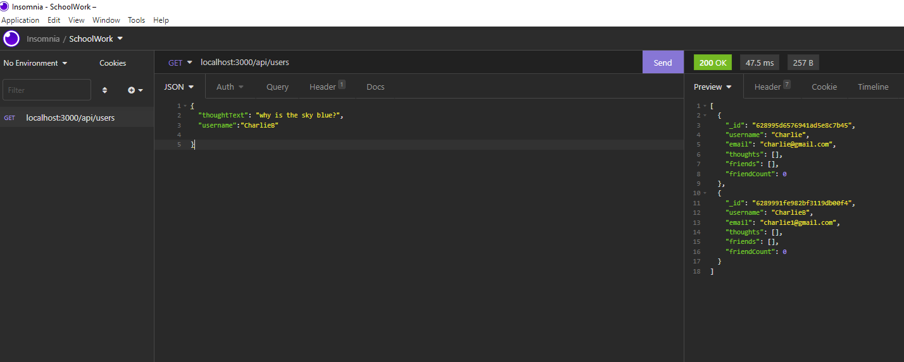

# Social Networking

## Table of Contents

[description](#description)
[installation](#installation)
[license](#license)
[usage](#usage)
[contribution](#contribution)
[questions](#questions)

## Description

This Social Networking application allows users to share their thoughts, react to friends’ thoughts, and create a friend list. This API was built using MongoDB to create a database, Express.js for routing and the Mongoose Object Data Modeling (ODM) library. Insomnia was used to demonstrate it functionality.

## Badges

## Installation

When used, please be attentive to keeping its folder structure.

## License

MIT

## Usage

Besides being a fun place for users to share and comment on their thoughts and perhaps build a friend list, this was a great application to build API and structure it using a powerful and flexible MongoDB.

## Contribution

Abdullah Al Hilfi provided me help with structuring and debugging this application.

## Questions

### GitHub Username: cnc500

### GitHub Repository: socialNetwork

### Email: cncarnevale@gmail.com

## Video URL
https://drive.google.com/file/d/1Ve66A1UN2tZQHR7pDRCl99nx8NigFFR9/view?usp=sharing

## Screenshot

